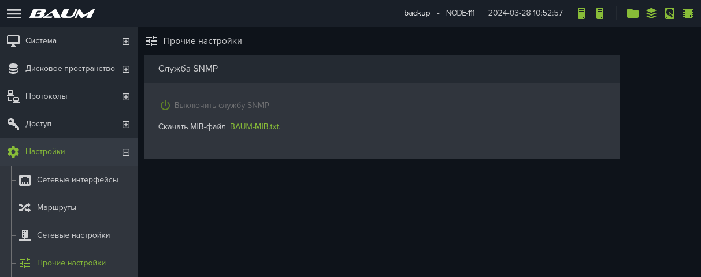
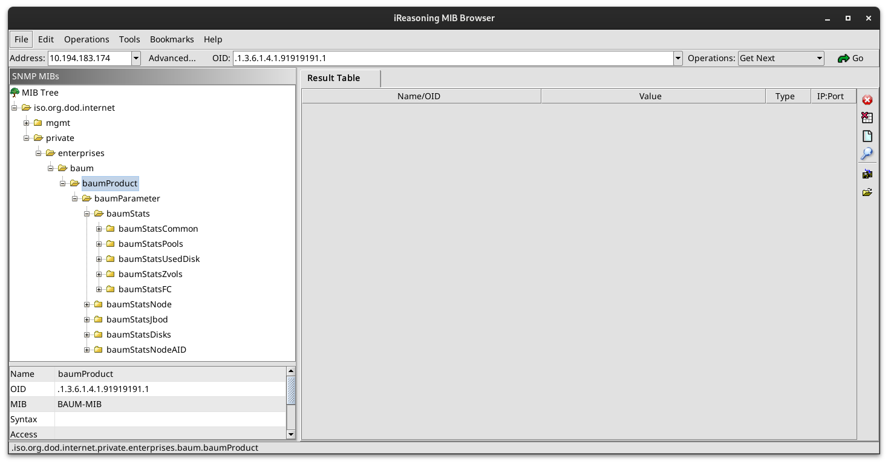

# Grafana Dashboard для СХД BAUMSTORAGE F+ Tech

## Настройка сбора SNMP метрик с СХД

### Создание конфигарации для snmp_exporter

1. Клонировать репозиторий snmp_exporter

```
git clone https://github.com/prometheus/snmp_exporter.git
```

2. Скачать в директорию ./snmp_exporter/generator/mibs-mibs файл BAUM-MIB.txt из WebUI СХД

<br>

<br>

3. Используя любой MIB браузер, подготовить конфигурацию для SNMP Exporter Generator и сохранить её в файл ./snmp_exporter/generator/generator-baum.yml)

<br>

<br>

generator-baum.yml
```
---
modules:
  baum:
    walk:
      - 1.3.6.1.4.1.91919191          # baum
      - 1.3.6.1.4.1.91919191.1        # baumProduct
      - 1.3.6.1.4.1.91919191.1.3      # baumParameter
      - 1.3.6.1.4.1.91919191.1.3.6    # baumStats
      - 1.3.6.1.4.1.91919191.1.3.7    # baumStatsNode
      - 1.3.6.1.4.1.91919191.1.3.8    # baumStatsJbod
      - 1.3.6.1.4.1.91919191.1.3.9    # baumStatsDisks
      - 1.3.6.1.4.1.91919191.1.3.10   # baumStatsNodeAID
      - 1.3.6.1.4.1.91919191.1.3.6.1  # baumStatsCommon
      - 1.3.6.1.4.1.91919191.1.3.6.2  # baumStatsPools
      - 1.3.6.1.4.1.91919191.1.3.6.3  # baumStatsUsedDisk
      - 1.3.6.1.4.1.91919191.1.3.6.4  # baumStatsZvols
      - 1.3.6.1.4.1.91919191.1.3.6.5  # baumStatsFC
```

4. Сгенерировать конфигурационный файл snmp-baum.yaml для snmp_exporter

```
$ ./snmp_exporter/generator/generator generate -m /usr/share/snmp/mibs -m ./snmp_exporter/generator/mibs-baum -g ./snmp_exporter/generator/generator-baum.yml -o /tmp/snmp-baum.yml
ts=2024-03-28T10:09:05.519Z caller=net_snmp.go:175 level=info msg="Loading MIBs" from=/usr/share/snmp/mibs:./snmp_exporter/generator/mibs-baum
ts=2024-03-28T10:09:05.564Z caller=main.go:53 level=info msg="Generating config for module" module=baum
ts=2024-03-28T10:09:05.566Z caller=main.go:68 level=info msg="Generated metrics" module=baum metrics=136
ts=2024-03-28T10:09:05.572Z caller=main.go:93 level=info msg="Config written" file=/tmp/snmp-baum.yml
```

### Настройка snmp_exporter

1. Скачайте дистрибутив snmp_exporter https://github.com/prometheus/snmp_exporter/releases, исполняемый файл скопируйте в директорию /usr/local/sbin/

2. Конфигурационный файл экспортера snmp.yaml скопируйте из дистрибутива в директорию /etc/prometheus_snmp_exporter

3. Создайте systemd unit файл /etc/systemd/system/snmp_exporter.service

```
[Unit]
Description=SNMP Exporter
After=network-online.target

# This assumes you are running snmp_exporter under the user "prometheus"

[Service]
User=prometheus
Restart=on-failure
ExecStart=/usr/local/sbin/snmp_exporter --config.file=/etc/prometheus_snmp_exporter/snmp*.yml

[Install]
WantedBy=multi-user.target
```

4. Запустите snmp_exporter

```
$ sudo systemctl daemon-reload
$ sudo systemctl enable ---now snmp_exporter
```

5. Проверка работы snmp_xporter

Для проверки работы экспортера воспользуйтесь утилитой curl, в параметре target укажите адрес контроллера СХД.

```
curl -s 'http://snmp_exporter.foobar.ru:9116/snmp?module=baum&target=192.168.0.11'
```


### Настройка Prometheus и Grafana

1. Внесите необходимые изменения в конфигурацию Prometheus - prometheus.yml

```
scrape_configs:
  - job_name: 'baum-fplus-storage1'
    metrics_path: /snmp

    params:
      module: [baum]
      target: [192.168.0.11]

    static_configs:
    - targets:
      - snmp_exporter.foobar.ru:9116
      labels:
        env: backup_storage

  - job_name: 'baum-fplus-storage2'
    metrics_path: /snmp

    params:
      module: [baum]
      target: [192.168.0.12]

    static_configs:
    - targets:
      - snmp_exporter.foobar.ru:9116
      labels:
        env: backup_storage
```

2. Импортируйте файл dashboard-baum.json в графану
